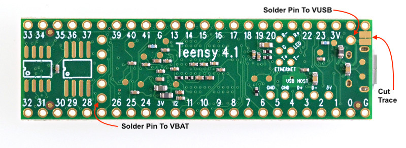
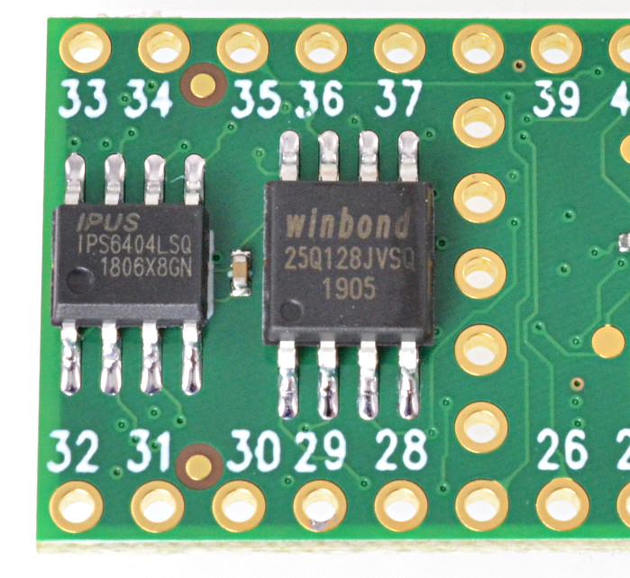

# Tympan_Rev_E_Hardware
Repository for Tympan Rev E Electronics and case designs

## Modifications To Teensy 4.1
This design is a daughter card for the Teensy 4.1 from PJRC. In order for them to play together nicely, you need to mod the Teensy 4.1.

In this case, the trace that connects two pads on the bottom of the Teensy needs to be cut. Since we are cutting that trace, we need to solder a pin to the VUSB right next to it.

We are also supplying battery power to VBAT, which goes to the Teensy RTC, so that pin needs to be connected as well. 

In our prototype, we are also adding in the [optional memory chips](https://www.pjrc.com/store/psram.html) that PJRC has kindly laid landing pads for.

