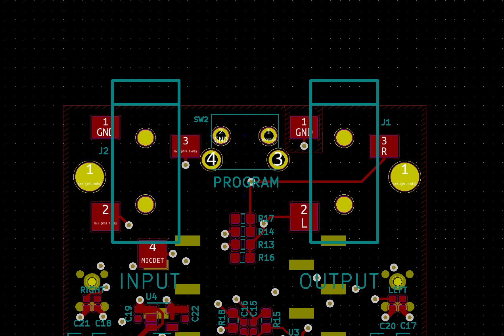

# Tympan Rev E Hardware v2.0.0
Repository for Tympan Rev E v2 Electronics and case designs. This version of the Rev E is based on the Teensy 4.1 by PJRC and incorporates the Teensy 4.1 into our own design, as we did with the Tympan Rev D. Checkout the v1 branch for the previous daughter card version of this project.

## Check Back For Updates

## Update

Push of 5/13/21
Added breakout of the Program pin to an Tympan board pushbutton.
Location of Pushbutton is between the IN OUT at the TOP of the board. 

There is an isse with the position of the coin cell battery and the position of the 3pin 2mm header for compatability with Rev D. This affects daughter cards that depend on the 3 pin header position. 

